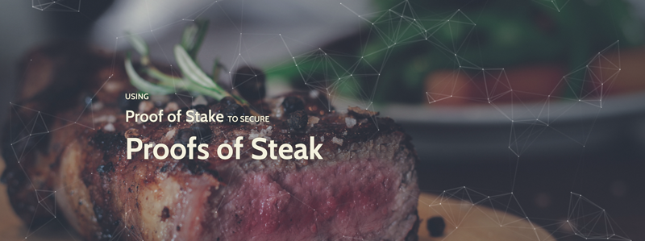

[https://steak.network](https://steak.network) <----- click this

- [DonationSplitter contract on Etherscan](https://etherscan.io/address/0x388a037ab169b128e70cf67e1228ecd03f0400f2)
- [ICS contract on Etherscan](https://etherscan.io/address/0x1debc6427df10a3193553382ec3cab99f9d702f3)
- [$TEAK Token contract on Etherscan](https://etherscan.io/token/0x7dd7f56d697cc0f2b52bd55c057f378f1fe6ab4b)

*Proof of Steak* is a real protocol that uses Proof of Stake and the TrueBit Classic protocol to create a curated registry. For the *Steak Network*, that registry is of a bunch of pictures of steaks.

[Please read the whitepaper I put a lot of work into it](steak-network_whitepaper.pdf).
